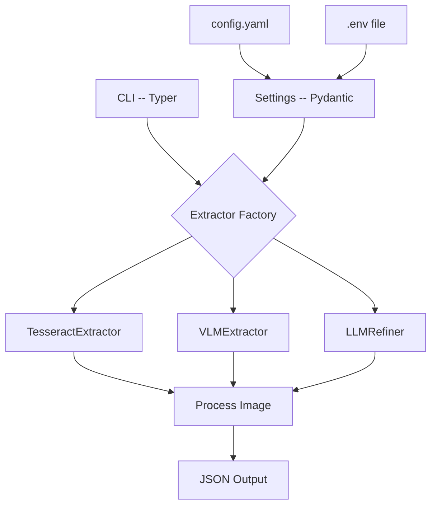

# Plan for Modular Image Number Extraction CLI

## 1. Project Goal
Create a robust, command-line interface (CLI) application to extract numerical data (like runner bib numbers) from images. The application will be designed with a modular and configurable architecture, allowing different extraction engines (OCR, VLM, LLM) to be easily swapped, combined, and configured.

## 2. Core Features
-   **Modern CLI for Image Processing**: A user-friendly CLI built with Typer to specify an image path and select an extraction method.
-   **Modular Extractor Interface**: A unified abstract base class (`Extractor`) for different extraction technologies.
-   **Interchangeable Backends**:
    -   **OCR Backend**: Initial implementation using Tesseract.
    -   **VLM Backend**: Placeholder for a Vision Language Model (e.g., GPT-4o, LLaVA).
    -   **LLM Backend**: Placeholder for a Large Language Model to refine or interpret results.
-   **Configuration Management**: A flexible system using a `config.yaml` file for general settings and environment variables for sensitive data (e.g., API keys).
-   **Standardized Output**: Consistent JSON output for easy parsing and integration with other tools.
-   **Structured Logging and Error Handling**: Robust logging for debugging and clear, specific error handling for operational reliability.

## 3. Proposed Architecture

The application is designed around a central `Extractor` interface, a factory function to select the appropriate implementation, and a configuration system that decouples settings from the code.

### Key Components

#### `src/image_rec_mod/config.py`
-   A `Settings` class using Pydantic will manage configuration.
-   It will load settings from `config.yaml` and environment variables (with `.env` file support for local development). This provides a clean separation of configuration and secrets. API keys for VLM/LLM services will be managed exclusively through environment variables.

#### `src/image_rec_mod/extractor.py`
-   The `Extractor` Abstract Base Class (ABC) will define the contract for all extractor implementations (e.g., an `extract(image_path: str) -> dict` method).

#### `src/image_rec_mod/backends/`
-   A new `backends` sub-package will house the concrete implementations to keep the project organized.
    -   `ocr.py`: Will contain `TesseractExtractor(Extractor)`.
    -   `vlm.py`: Will contain a placeholder `VLMExtractor(Extractor)`.
    -   `llm.py`: Will contain a placeholder `LLMRefiner(Extractor)`.

#### `src/image_rec_mod/cli.py`
-   The CLI will be built using **Typer**. We choose Typer over `argparse` because it reduces boilerplate, provides automatic help text generation, and uses Python type hints for validation, leading to more maintainable and user-friendly code.
-   It will accept arguments for the image path and allow overriding the default extractor specified in the config file.
-   An **Extractor Factory** function (`get_extractor(name: str, settings: Settings) -> Extractor`) will be responsible for instantiating the correct extractor class based on the provided name. It will inject the necessary configuration (like API keys) into the extractor instance.

## 4. Project Dependencies
-   **CLI**: `typer[all]`
-   **Configuration**: `pydantic`, `pydantic-settings`, `pyyaml`
-   **OCR**: `pytesseract`, `Pillow`
-   **VLM/LLM (Placeholders)**: `openai`, `google-generativeai`

## 5. Error Handling and Logging

### Logging
-   Structured logging will be implemented using Python's built-in `logging` module.
-   A central logger will be configured in `cli.py` to output logs in a consistent format (e.g., JSON) with levels (INFO, WARNING, ERROR).
-   Log messages will provide context for operations, such as which extractor is being used and the image being processed.

### Error Handling
-   Custom exceptions will be defined in `src/image_rec_mod/exceptions.py` (e.g., `ExtractorError`, `ConfigurationError`).
-   The CLI will include `try...except` blocks to catch these specific exceptions and provide user-friendly error messages without exposing stack traces for common failures (e.g., file not found, invalid API key).

## 6. Implementation Steps
1.  **Setup Project Structure and Dependencies**: Create the new directory structure (`src/image_rec_mod/backends`, `src/image_rec_mod/exceptions.py`) and add dependencies to `pyproject.toml`.
2.  **Refactor the Extractor Interface**: Rename `OCRExtractor` to `Extractor` in `src/image_rec_mod/extractor.py` and move it from the root of the module.
3.  **Implement Configuration**: Create `config.py` with a Pydantic `Settings` model to load from `config.yaml` and environment variables.
4.  **Implement Tesseract Extractor**: Move the `TesseractExtractor` class to `src/image_rec_mod/backends/ocr.py`.
5.  **Create Placeholder Backends**: Create the placeholder `VLMExtractor` and `LLMRefiner` classes in their respective files under `src/image_rec_mod/backends/`.
6.  **Build the CLI**: Implement the Typer-based CLI in `src/image_rec_mod/cli.py`, including the extractor factory and logging configuration.
7.  **Configure Entry Point**: Add the script entry point to `pyproject.toml` for the Typer application.
8.  **Add Error Handling**: Implement custom exceptions and add error handling to the CLI.
9.  **Update Documentation**: Update `README.md` with new installation and usage instructions, including configuration.
10. **Add Tests**: Create tests for the configuration loader, extractor factory, and the Tesseract extractor.
